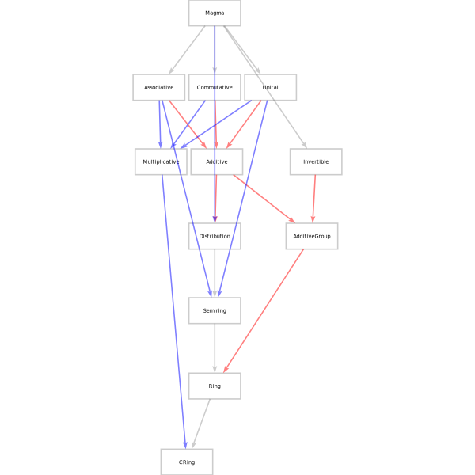
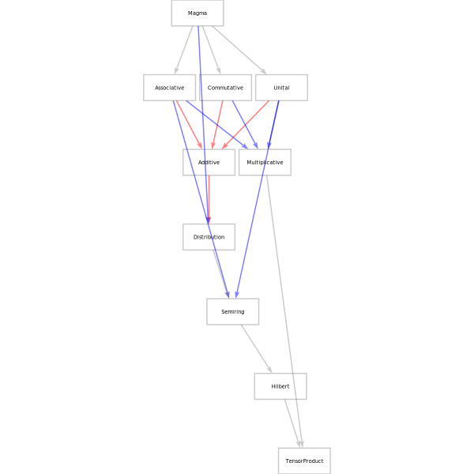

[numhask-dev](https://tonyday567.github.io/numhask-dev) 
===

Numeric class heirarchy representations for [numhask](https://tonyday567.github.com/numhask)

field superclasses
---

tensor product superclasses
---

recipe
---

~~~
stack build --exec "$(stack path --local-install-root)/bin/numhask-render"
~~~
