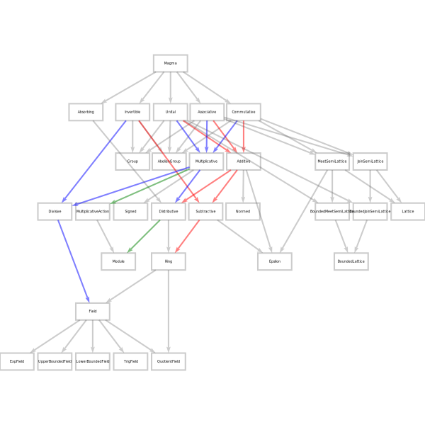

numhask
===

[](https://travis-ci.org/tonyday567/numhask) [](https://gitter.im/numhask/Lobby)

A numeric class hierarchy, providing a structure for numbers and functions that combine them.

Field hierarchy
---

[](numhask/other/field.svg)


NumHask class structure
---

[](numhask/other/numhask.svg)


`numhask` begins with separately named magma-derived classes for addition and multiplication, and then being symetrical in the treatment of the two heirarchies.  A short magma structure is provided with the intention of supplying appropriate classes for operators that are neither addition nor multiplication, but this structure is not hooked up to the main classes.

To be as compatible as practical with the existing haskell ecosystem.  Ints, Integers, Floats, Doubles and Complex are taken from base and given numhask class instances, so they are also Num instances.  Monoid and Semigroup are not used in numhask to maintain compatability.

`numhask` replaces all the relevant numeric operators in Prelude, so you're going to get clashes.

QuickCheck tests of numeric laws are included.  This also includes tracking where laws are approximate or fail for non-exact numbers.

The usual operators (+) and (*) operators are reserved for commutative relationships, with plus and times being used for non-commutative ones.

In summary, the library doesn't do anything fancy. But if having to define `(*)` when you just want a `(+)` offends your sensibilities, it may bring some sanity.

NumHask.Prelude
---

``` {.sourceCode .literate .haskell}
{-# LANGUAGE NoImplicitPrelude #-}
import NumHask.Prelude
```

'Numhask.Prelude' is designed as a drop-in replacement for Prelude and 'NoImplicitPrelude' is obligatory. Behind the scenes, the module wraps [protolude](https://www.stackage.org/package/protolude).

