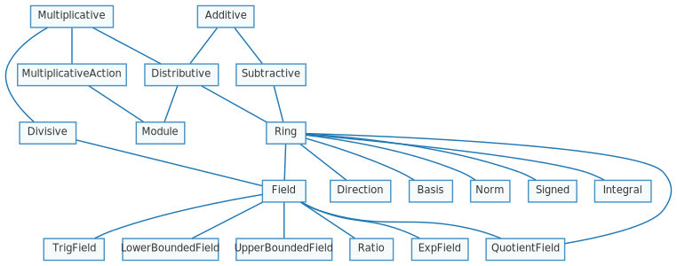

numhask
===

[](https://hackage.haskell.org/package/numhask)
[](https://github.com/tonyday567/numhask/actions?query=workflow%3Ahaskell-ci) [](http://packdeps.haskellers.com/reverse/numhask)

This package provides numeric classes alternate to the prelude specified in haskell98.

The numeric class constellation looks somewhat like:



Usage
===

``` haskell
{-# LANGUAGE RebindableSyntax #-}
import NumHask.Prelude
```
See the documentation in the Numhask module for a detailed overview.

NumHask.Prelude passes through the Prelude, with the exception of functions which include Num, Rational, Integral or Real constraints.

Develop
===

```
stack build --test --haddock --file-watch
```
